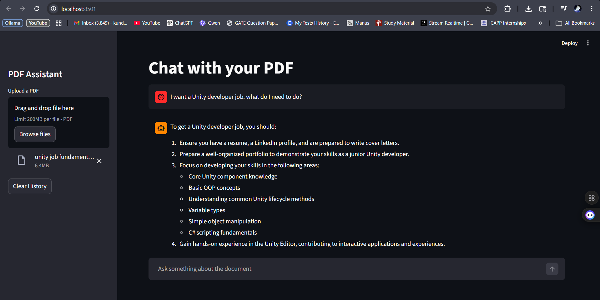

# PDF RAG Chatbot - Local Embeddings

A Retrieval-Augmented Generation (RAG) application that enables intelligent Q&A interactions with PDF documents using local embeddings and Groq's LLM API. Extract insights from your PDFs through a conversational interface powered by state-of-the-art NLP models.



## 📋 Table of Contents

- [Overview](#overview)
- [Tech Stack](#tech-stack)
- [Models Used](#models-used)
- [Architecture](#architecture)
- [Installation](#installation)
- [Quick Start](#quick-start)
- [Features](#features)
- [Project Structure](#project-structure)
- [Troubleshooting](#troubleshooting)

## 🎯 Overview

This RAG application allows you to:
- Upload PDF documents
- Automatically extract and process text content
- Ask questions about the document content
- Receive context-aware answers powered by Large Language Models
- Use persistent vector storage for efficient retrieval

The system is designed to work entirely with **local embeddings**, eliminating the need for expensive external embedding APIs while maintaining high-quality semantic search capabilities.

## 🛠️ Tech Stack

| Component | Technology | Purpose |
|-----------|-----------|---------|
| **Frontend/UI** | Streamlit | Interactive web interface |
| **PDF Processing** | PyPDF | Text extraction from PDF documents |
| **Embeddings** | Sentence-Transformers | Local semantic embeddings (all-MiniLM-L6-v2) |
| **Vector Database** | ChromaDB | Persistent vector storage and retrieval |
| **LLM** | Groq API | Fast inference for answer generation |
| **Text Processing** | LangChain | Intelligent text chunking and splitting |
| **API Client** | Groq Python SDK | Integration with Groq's LLM service |

## 🤖 Models Used

### Embedding Model
- **Model**: `all-MiniLM-L6-v2` (Sentence-Transformers)
  - **Dimensions**: 384
  - **Advantages**: 
    - Lightweight (~80MB)
    - Fast inference
    - Excellent semantic understanding
    - Runs entirely locally
  - **Type**: Multi-purpose sentence embeddings for semantic search

### LLM (Language Model)
- **Provider**: Groq
- **Model**: llama-3.1-8b-instant (configurable via Groq API)
  - **Advantages**:
    - Ultra-fast inference (~1000 tokens/second)
    - High-quality reasoning and language understanding
    - Speculative decoding for improved performance
  - **Cost**: Pay-as-you-go pricing or free tier

### Text Splitter
- **Algorithm**: RecursiveCharacterTextSplitter (LangChain)
  - **Chunk Size**: 1000 characters
  - **Overlap**: 100 characters
  - **Purpose**: Maintains context while creating manageable chunks for embedding

## 🏗️ Architecture

### Data Flow
```
PDF Upload
    ↓
[PyPDF] Extract Text
    ↓
[LangChain] Split into Chunks (1000 char, 100 overlap)
    ↓
[Sentence-Transformers] Generate Local Embeddings (384-dim)
    ↓
[ChromaDB] Store Vectors & Metadata Persistently
    ↓
User Query
    ↓
[Sentence-Transformers] Embed Query (Same model)
    ↓
[ChromaDB] Semantic Search (Top-K retrieval)
    ↓
[Groq LLM] Generate Answer (with retrieved context)
    ↓
User-Facing Response
```

### Component Breakdown

#### 1. **DataLoader** (`data_loader.py`)
Responsible for:
- Loading PDF files and extracting text using PyPDF
- Splitting text into manageable chunks using LangChain
- Generating embeddings locally using Sentence-Transformers
- Tracking extraction statistics (pages, character count, etc.)

#### 2. **VectorDB** (`vector_db.py`)
Manages:
- Persistent vector storage using ChromaDB
- Creating and managing collections for document vectors
- Upserting embeddings in batches (prevents memory issues)
- Semantic search queries with configurable top-K results
- Database reset functionality

#### 3. **Main Application** (`main.py`)
Features:
- Streamlit-based web interface
- Session state management for chat history
- PDF file upload and processing workflow
- Query/response generation using Groq API
- Resource caching for performance optimization
- Real-time processing status updates

## 📦 Installation

### System Requirements
- **Python**: 3.8 or higher
- **RAM**: Minimum 4GB (8GB+ recommended for comfortable use)
- **Disk Space**: ~500MB for dependencies + storage for vector DB
- **Operating System**: Windows, macOS, or Linux

### Prerequisites
- Git (optional, for cloning)
- Active internet connection (for Groq API)

### Step-by-Step Setup

#### 1. Clone or Download the Project
```bash
# If using git
git clone <repository-url>
cd "RAG Application - PDF chatbot"

# Or manually download and extract the files
```

#### 2. Create a Python Virtual Environment
```bash
# Windows
python -m venv venv
venv\Scripts\activate

# macOS/Linux
python3 -m venv venv
source venv/bin/activate
```

#### 3. Install Dependencies
```bash
pip install -r requirements.txt
```

#### 4. Set Up Groq API Key
You have two options:

**Option A: Using Streamlit Secrets (Recommended)**
1. Create a `.streamlit` directory in your project root:
   ```bash
   mkdir .streamlit
   ```
2. Create a file named `secrets.toml` inside `.streamlit`:
   ```bash
   # Windows
   type nul > .streamlit\secrets.toml
   
   # macOS/Linux
   touch .streamlit/secrets.toml
   ```
3. Add your Groq API key:
   ```toml
   GROQ_API_KEY = "your_groq_api_key_here"
   ```

**Option B: Environment Variable**
```bash
# Windows (PowerShell)
$env:GROQ_API_KEY="your_groq_api_key_here"

# Windows (Command Prompt)
set GROQ_API_KEY=your_groq_api_key_here

# macOS/Linux
export GROQ_API_KEY="your_groq_api_key_here"
```

**How to Get Groq API Key:**
1. Visit [Groq Console](https://console.groq.com)
2. Sign up for a free account
3. Generate an API key
4. Copy and paste it in the configuration

## 🚀 Quick Start

### Run the Application
```bash
# Ensure your virtual environment is activated
streamlit run main.py
```

The app will:
- Open automatically in your browser (usually `http://localhost:8501`)
- Display a sidebar for PDF upload
- Show chat interface for Q&A

### Using the Application

1. **Upload a PDF**:
   - Click "Upload a PDF" in the sidebar
   - Select your PDF file from your local machine
   - Wait for processing to complete

2. **Ask Questions**:
   - Type your question in the chat input
   - Press Enter or click Send
   - The app will retrieve relevant sections and generate an answer

3. **Clear History**:
   - Click "Clear History" button to reset the conversation

## ✨ Features

### Document Processing
- ✅ Automatic PDF text extraction
- ✅ Intelligent text chunking with overlap
- ✅ Support for multi-page documents
- ✅ Error handling for corrupted or empty PDFs
- ✅ Processing status indicators

### Retrieval
- ✅ Semantic similarity search
- ✅ Configurable top-K retrieval (default: 5 chunks)
- ✅ Source tracking (which PDF sections were used)
- ✅ Persistent vector storage

### Conversation
- ✅ Multi-turn chat history
- ✅ Session state management
- ✅ Real-time response generation
- ✅ Context-aware answers using retrieved sections

### Performance
- ✅ Cached resource loading
- ✅ Batch processing for embeddings
- ✅ Efficient ChromaDB queries
- ✅ Fast local embeddings

## 📁 Project Structure

```
RAG Application - PDF chatbot/
├── main.py                 # Main Streamlit application
├── data_loader.py          # PDF processing and embedding generation
├── vector_db.py            # Vector database management (ChromaDB)
├── meow.py                 # Experimental embedding tests
├── requirements.txt        # Python dependencies
├── README.md               # This file
├── .streamlit/
│   └── secrets.toml        # API key configuration (create this)
└── chroma_storage/         # Vector database storage (auto-created)
    ├── chroma.sqlite3      # Persistent vector store
    └── [collection-uuid]/  # Embedded vector collections
```

## 🔧 Configuration

### Adjusting Chunk Size
Edit `data_loader.py`:
```python
self.text_splitter = RecursiveCharacterTextSplitter(
    chunk_size=1000,      # Increase for larger contexts
    chunk_overlap=100     # Increase for more overlap
)
```

### Changing Retrieval Top-K
Edit `main.py` or `vector_db.py`:
```python
db.search(query_vector, top_k=10)  # Default is 5, adjust as needed
```

### Using Different Embedding Model
Edit `data_loader.py`:
```python
def __init__(self, model_name='all-MiniLM-L6-v2'):
    # Try alternatives:
    # - 'all-mpnet-base-v2' (768-dim, more accurate but slower)
    # - 'all-distilroberta-v1' (768-dim, good balance)
    # - 'paraphrase-MiniLM-L6-v2' (384-dim, paraphrase-focused)
    self.model = SentenceTransformer(model_name)
```

## 🐛 Troubleshooting

### Issue: "GROQ_API_KEY not found in secrets"
**Solution:**
- Create `.streamlit/secrets.toml` with your API key
- Restart the Streamlit app
- Verify the file path is correct

### Issue: "No text extracted from PDF"
**Causes & Solutions:**
- PDF is scanned image (no extractable text)
  - Solution: Use OCR tools first
- PDF is encrypted
  - Solution: Remove encryption in Adobe Reader or similar
- Try: Check if the PDF opens in a text editor

### Issue: Slow embedding generation
**Solutions:**
- Use a lighter model like `all-MiniLM-L6-v2` (already set)
- Reduce chunk overlap
- Ensure you have adequate RAM
- Consider GPU acceleration (not currently implemented)

### Issue: "ChromaDB collection error"
**Solution:**
- Delete the `chroma_storage/` folder to reset
- Click "Clear History" in the app
- Restart the application

### Issue: LLM not returning answers
**Solutions:**
- Verify Groq API key is valid
- Check internet connection
- Ensure API quota is not exceeded
- Verify document contains extractable text

## 📊 Performance Metrics

On a typical machine with:
- CPU: Intel i7/AMD Ryzen 5+
- RAM: 8GB+
- SSD: Standard storage

**Expected Performance:**
- PDF extraction: 1-10 seconds (varies with document size)
- Embedding generation: 0.5-2 seconds (for 100 chunks)
- Query search: <100ms
- LLM response: 1-5 seconds

## 🔒 Security Notes

- API keys are stored locally in `.streamlit/secrets.toml`
- Never commit `.streamlit/secrets.toml` to version control
- Add to `.gitignore`:
  ```
  .streamlit/secrets.toml
  chroma_storage/
  __pycache__/
  *.pyc
  venv/
  ```

## 📚 Dependencies Overview

| Package | Version | Purpose |
|---------|---------|---------|
| streamlit | Latest | Web UI framework |
| sentence-transformers | Latest | Local embeddings |
| chromadb | Latest | Vector database |
| langchain | Latest | Text processing utilities |
| groq | Latest | LLM API client |
| pypdf | Latest | PDF text extraction |

See `requirements.txt` for exact versions.

## 🚀 Deployment

### Local Streamlit Sharing (Cloud)
```bash
streamlit run main.py --logger.level=debug
```
Then use Streamlit Community Cloud for hosting.

### Docker Deployment
Create a `Dockerfile`:
```dockerfile
FROM python:3.10-slim
WORKDIR /app
COPY requirements.txt .
RUN pip install -r requirements.txt
COPY . .
CMD ["streamlit", "run", "main.py"]
```

### Environment Variables for Production
```bash
GROQ_API_KEY=your_key_here
STREAMLIT_SERVER_PORT=8501
STREAMLIT_SERVER_ADDRESS=0.0.0.0
```

## 📝 License

[Add your license here]

## 🤝 Contributing

Contributions are welcome! Please feel free to submit pull requests or open issues.

## 💡 Future Enhancements

- [ ] Support for other document formats (DOCX, TXT, etc.)
- [ ] Multiple document simultaneous Q&A
- [ ] Custom LLM model selection
- [ ] Advanced filtering and metadata search
- [ ] Conversation export functionality
- [ ] GPU acceleration support
- [ ] Docker deployment templates
- [ ] Advanced analytics dashboard

## 📧 Support

For issues or questions:
- Check the [Troubleshooting](#troubleshooting) section
- Review error messages in the Streamlit terminal
- Check Groq API status at https://status.groq.com

---

**Happy Chatting! 🎉**
